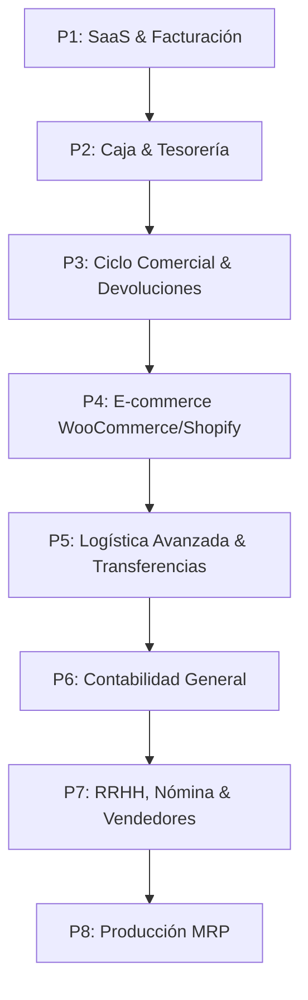

# Roadmap de Desarrollo: Transformación a SaaS ERP

Este documento detalla los módulos necesarios para transformar el sistema de facturación e inventario actual en un **ERP SaaS omnicanal** completo, organizado de mayor a menor prioridad de negocio.

---

---

## Fases de Desarrollo por Prioridad

### 🥇 Prioridad 1: Core de SaaS y Monetización (Suscripciones)
*¿Por qué es prioridad 1?* Si el sistema se comercializará como SaaS, necesitas poder cobrar a tus clientes desde el día uno para sostener el proyecto.

*   **Planes y Suscripciones:**
    *   Definición de planes (ej: Básico, Pro, Enterprise).
    *   Límites de uso por plan (ej: número máximo de tiendas, productos, facturas mensuales, usuarios).
*   **Pasarela de Pagos (Stripe / PayPal / Pagos Locales):**
    *   Cobro recurrente mensual o anual automatizado.
    *   Manejo de estados de suscripción (Activa, Pendiente de pago, Cancelada, Período de gracia).
*   **Portal del Cliente:**
    *   Historial de facturas de cobro del SaaS, cambio de plan y métodos de pago.
*   **Tenant Restricciones:**
    *   Middlewares en Laravel para bloquear accesos o escrituras cuando el tenant supere los límites de su plan o tenga facturas vencidas.

---

### 🥈 Prioridad 2: Tesorería Básica - Control de Caja y Turnos
*¿Por qué es prioridad 2?* En el comercio y POS, el descuadre de caja diario es el principal problema. Si no se puede auditar el efectivo al final del día, las facturas pierden validez operativa.

*   **Apertura y Cierre de Caja (Arqueo):**
    *   Registro del saldo inicial de efectivo al iniciar el día/turno.
    *   Control de ventas por método de pago durante el turno.
    *   Declaración de efectivo final del cajero y reporte de diferencias (sobrantes y faltantes).
*   **Caja Chica:**
    *   Registro de pequeños gastos operativos diarios (papelería, limpieza, transporte) pagados directamente de la caja.

---

### 🥉 Prioridad 3: Ciclo Comercial Completo (Cuentas por Pagar y Devoluciones)
*¿Por qué es prioridad 3?* Es fundamental para completar el flujo administrativo diario del cliente comercializador.

*   **Cuentas por Pagar (Proveedores):**
    *   Registro de compras a crédito.
    *   Control de saldo de deudas a proveedores y calendario de vencimientos de pagos.
*   **Notas de Crédito y Débito:**
    *   Anulación parcial o total de facturas de venta (devoluciones de clientes) restaurando stock al inventario.
    *   Ajustes de precios o descuentos posteriores a la facturación de manera legal y fiscal.

---

### 🚀 Prioridad 4: Integración con E-commerce (WooCommerce y Shopify)
*¿Por qué es prioridad 4?* La omnicanalidad es el mayor gancho de ventas para un SaaS POS/ERP hoy en día. Los negocios venden físicamente y online simultáneamente.

*   **Sincronización de Productos e Inventario:**
    *   Sincronización automática de stock del ERP hacia WooCommerce/Shopify al registrar ventas físicas o compras a proveedores. Sincroniza nombres, precios y descripciones.
*   **Descarga Automática de Pedidos:**
    *   Los pedidos web entran al ERP automáticamente como cotizaciones o facturas completadas.
    *   Generación automática de clientes en el ERP a partir de los compradores de la web.
*   **Webhooks de Actualización:**
    *   Notificación inmediata entre plataformas para evitar sobreventas (ventas sin stock).

---

### 📦 Prioridad 5: Logística Avanzada y Sucursales
*¿Por qué es prioridad 5?* Ideal para clientes medianos que empiezan a tener múltiples tiendas o una bodega de distribución central.

*   **Transferencias de Inventario:**
    *   Flujo controlado: Solicitud de traslado $\rightarrow$ Despacho (en tránsito) $\rightarrow$ Confirmación de recepción en destino.
*   **Toma Física y Ajustes de Stock:**
    *   Módulo para inventarios cíclicos y reportes de discrepancias físicas vs sistema (mermas, robos, roturas).
*   **Atributos Avanzados de Stock:**
    *   Control por Lote y Fecha de Vencimiento (indispensable para alimentos/farmacia).
    *   Control por Números de Serie (indispensable para electrónica/tecnología).

---

### 📊 Prioridad 6: Contabilidad General
*¿Por qué es prioridad 6?* Aunque es sumamente importante, las micro y pequeñas empresas (clientes iniciales de un SaaS) suelen priorizar la facturación y el inventario sobre la contabilidad formal, la cual delegan externamente.

*   **Plan de Cuentas Configurable:**
    *   Estructura jerárquica de cuentas (Activos, Pasivos, Capital, Ingresos, Costos, Gastos).
*   **Asiento Contable Automático (Partida Doble):**
    *   Reglas para que al facturar, comprar o registrar abonos se generen automáticamente los débitos y créditos contables correspondientes.
*   **Estados Financieros:**
    *   Generación en tiempo real del Balance General y el Estado de Pérdidas y Ganancias (P&G).

---

### 👥 Prioridad 7: Recursos Humanos, Nómina y Comisiones
*¿Por qué es prioridad 7?* Automatiza la gestión interna del personal y la fuerza de ventas del cliente.

*   **Cálculo de Comisiones a Vendedores:**
    *   Reglas dinámicas basadas en metas de venta o cobros efectivos vinculados al módulo de vendedores (`Seller`).
*   **Nómina Básica (Planilla):**
    *   Cálculo de salarios mensuales/quincenales, horas extras, bonos y deducciones fiscales de ley.
*   **Control de Asistencia:**
    *   Registro de entrada/salida de personal desde el mismo panel POS/ERP.

---

### 🛠️ Prioridad 8: Producción / Manufactura (MRP)
*¿Por qué es prioridad 8?* Es un módulo de nicho. Solo lo requerirán aquellos clientes SaaS que transformen materias primas.

*   **Fórmula del Producto (BOM - Bill of Materials):**
    *   Definición de insumos necesarios para fabricar una unidad de producto terminado (ej: Harina, Azúcar, Huevo $\rightarrow$ Pastel).
*   **Órdenes de Producción:**
    *   Proceso que consume automáticamente materias primas del inventario y da de alta el producto terminado correspondiente, calculando el costo real de producción.
