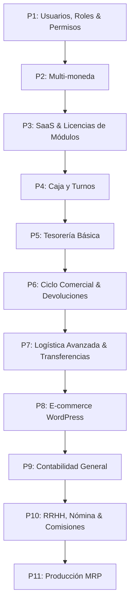

# Roadmap de Desarrollo: Transformación a SaaS ERP

Este documento detalla los módulos necesarios para transformar el sistema de facturación e inventario actual en un **ERP SaaS omnicanal** completo. Se ha reorganizado el orden de desarrollo para optimizar la arquitectura, minimizar la reescritura de código y maximizar el valor de negocio.

---

---

## Fases de Desarrollo por Prioridad Técnica y Operativa

### 🥇 Prioridad 1: Usuarios, Roles y Permisos (Configuración General)
*¿Por qué es prioridad 1?* Es el pilar de la seguridad y el control de acceso. Antes de exponer módulos operativos como Caja o Tesorería, el sistema debe saber qué usuario (cajero, administrador, contador, gerente) puede ver o modificar cada sección.

*   **Alcance:**
    *   Gestión de usuarios internos y asignación de roles.
    *   Configuración detallada de permisos (Lectura, Escritura, Modificación, Eliminación) por módulo.
    *   Restricción de vistas y endpoints API de acuerdo al rol del usuario.
*   **⚠️ Impacto en lo existente:**
    *   **Tablas afectadas:** `users`, `roles`, `permissions` (tablas creadas por Spatie, pero sin interfaz ni middleware restrictivo a nivel de negocio).
    *   **Código:** Requiere implementar y estandarizar Middlewares en Laravel para bloquear accesos en los endpoints API ya existentes.

---

### 🥈 Prioridad 2: Multi-moneda (Tasas de Cambio y Conversiones)
*¿Por qué es prioridad 2?* **Dependencia Crítica.** Si no se desarrolla en esta etapa, todos los módulos financieros posteriores (Caja, Tesorería, Cuentas por Pagar, Contabilidad) se tendrán que reescribir más adelante para soportar transacciones en divisas extranjeras y conversiones de tipo de cambio.

*   **Alcance:**
    *   Definición de monedas (ej. USD, EUR, Moneda Local) y tasa de cambio del día.
    *   Soporte para cobros, compras y precios de productos en múltiples divisas.
    *   Reportes financieros consolidados en la moneda base del tenant.
*   **⚠️ Impacto en lo existente:**
    *   **Tablas afectadas:** `stores` (divisa por defecto), `products` (definición de precios), `invoices`/`invoice_details` (divisa de facturación y tasa de cambio histórica), `purchases`/`purchase_details` (moneda de costo).
    *   **Código:** Modificar los controladores de facturación y compras para registrar el valor de cambio en cada transacción histórica.

---

### 🥉 Prioridad 3: SaaS y Licenciamiento por Módulos (Suscripciones Dinámicas)
*¿Por qué es prioridad 3?* Permite comercializar el ERP. En este modelo SaaS, la licencia de cada tenant se adaptará a los módulos a los que tiene acceso, sumando el precio individual de cada módulo activado al costo base total de la suscripción.

*   **Alcance:**
    *   **Planes y Precios Modulares:** Configuración de un precio base + la suma de los precios de los módulos activos.
    *   **Control de Activación:** Habilitar/Deshabilitar módulos específicos por tenant (`Caja`, `Contabilidad`, `E-commerce`, etc.).
    *   **Pasarela de Pagos (Stripe / PayPal):** Cobro recurrente calculado dinámicamente según los módulos activos.
    *   **Tenant Restricciones:** Middlewares que verifican el estatus de la suscripción y bloquean endpoints de módulos no licenciados.
*   **⚠️ Impacto en lo existente:**
    *   **Tablas afectadas:** `organizations`, `modules`, `organization_module` (las relaciones básicas de módulos ya existen en DB, pero requieren lógica de negocio y precios por módulo).
    *   **Código:** Creación de un middleware global que valide los privilegios del Tenant en base a los módulos contratados antes de procesar cualquier request.

---

### 🚀 Prioridad 4: Caja y Turnos (Punto de Venta - POS)
*¿Por qué es prioridad 4?* El descuadre diario de efectivo es el principal dolor de cabeza de los comercios. Este módulo valida que cada venta realizada en el POS quede asociada a un cajero y a un turno auditado.

*   **Alcance:**
    *   **Apertura y Cierre de Caja (Arqueo):** Declaración de saldo inicial, conteo de efectivo final, y reporte de discrepancias (sobrantes/faltantes).
    *   **Corte de Turno:** Registro detallado de ventas ordenadas por método de pago durante un lapso de tiempo específico.
*   **⚠️ Impacto en lo existente:**
    *   **Tablas afectadas:** `invoices` (las facturas físicas del POS deben registrar de forma obligatoria el ID del turno de caja).
    *   **Código:** El controlador de facturas debe validar que el vendedor tenga una caja abierta en su tienda antes de procesar el pago.

---

### 💵 Prioridad 5: Tesorería Básica (Cuentas y Flujos)
*¿Por qué es prioridad 5?* Consolida todo el flujo de dinero que entra y sale del negocio, yendo más allá de las ventas POS.

*   **Alcance:**
    *   **Caja Chica:** Registro y control de pequeños egresos diarios autorizados.
    *   **Cuentas Bancarias:** Gestión de múltiples cuentas bancarias de la organización.
    *   **Movimientos de Fondos:** Registro de depósitos, retiros y transferencias entre cajas y bancos.
*   **⚠️ Impacto en lo existente:**
    *   **Tablas afectadas:** `invoices` y `credits` (los abonos de clientes y pagos de facturas deben asociarse al destino final de los fondos: una caja chica o una cuenta de banco específica).

---

### 🔄 Prioridad 6: Ciclo Comercial Completo y Devoluciones
*¿Por qué es prioridad 6?* Automatiza los flujos comerciales avanzados para clientes B2B o comercios medianos, gestionando créditos con proveedores y devoluciones de clientes.

*   **Alcance:**
    *   **Cuentas por Pagar (Proveedores):** Registro de compras a crédito y calendario de pagos pendientes.
    *   **Notas de Crédito y Débito (Devoluciones):** Emisión de notas de crédito que anulan deudas o generan saldos a favor del cliente, reintegrando automáticamente el inventario dañado o devuelto.
*   **⚠️ Impacto en lo existente:**
    *   **Tablas afectadas:** `invoices` y `invoice_details` (reducción de saldos e historial de abonos), `credits`/`credit_details`, `purchases` (para vincular cuentas por pagar), e `inventories`/`inventory_details`.
    *   **Código:** La lógica de devolución debe recalcular el stock de forma atómica en el inventario y reversar saldos de cuentas por cobrar.

---

### 📦 Prioridad 7: Logística Avanzada y Transferencias
*¿Por qué es prioridad 7?* Indispensable para negocios con múltiples tiendas o bodegas de distribución que mueven mercancía constantemente.

*   **Alcance:**
    *   **Transferencia entre Sucursales:** Flujo controlado que incluye los estados de: *Solicitado* $\rightarrow$ *En Tránsito* $\rightarrow$ *Confirmado/Recibido*.
    *   **Control por Lotes y Fechas de Vencimiento:** Vital para industrias como alimentos y medicamentos.
    *   **Números de Serie:** Control de trazabilidad único por unidad (electrónicos, maquinaria).
    *   **Ajustes de Inventario:** Módulo para inventarios cíclicos y mermas.
*   **⚠️ Impacto en lo existente:**
    *   **Tablas afectadas:** `products` (añadir campos de lote, vencimiento, y flag de control de serie), `inventories`/`inventory_details` (para registrar el detalle del stock por sucursal).
    *   **Código:** El sistema de despacho de facturas debe exigir el número de lote o serie al descontar mercancía si el producto lo requiere.

---

### 🌐 Prioridad 8: Integración con E-commerce (WordPress/WooCommerce)
*¿Por qué es prioridad 8?* Expande la venta física hacia la digital, sincronizando existencias reales para evitar sobreventas accidentales.

*   **Alcance:**
    *   **Sincronización Bidireccional:** Exporta productos, descripciones, precios y stock real hacia WooCommerce.
    *   **Pedidos Web Automatizados:** Los pedidos de la web ingresan directamente como facturas o cotizaciones pendientes en el ERP.
    *   **Sincronización mediante Webhooks:** Actualizaciones inmediatas del stock tras registrar ventas POS.
*   **⚠️ Impacto en lo existente:**
    *   **Tablas afectadas:** `products` (añadir ID de correspondencia externa ej. `woocommerce_id`) e `inventories`.
    *   **Código:** Requiere agregar Listeners u Observers en Laravel para disparar llamadas de API externas cada vez que el stock físico sufra cambios.

---

### 📊 Prioridad 9: Contabilidad General
*¿Por qué es prioridad 9?* Es el receptor final de la información financiera. Aunque es crucial, las empresas suelen dar prioridad al inventario y facturación antes de implementar la contabilidad automatizada.

*   **Alcance:**
    *   **Plan de Cuentas Jerárquico:** Configurable por organización (Activos, Pasivos, Capital, Ingresos, Gastos).
    *   **Asiento Contable Automático (Partida Doble):** Generación automática de créditos y débitos al facturar, comprar, pagar nóminas o mover efectivo.
    *   **Estados Financieros:** Balance General y Estado de Pérdidas y Ganancias (P&G) en tiempo real.
*   **⚠️ Impacto en lo existente:**
    *   **Tablas afectadas:** Transversal a todos los módulos transaccionales (`invoices`, `purchases`, `credits`, pagos de caja, cuentas por pagar/cobrar), los cuales deben registrar pólizas/asientos automáticos.
    *   **Código:** Se debe diseñar un motor de reglas contables (Accounting Engine) que escuche eventos del sistema para generar los registros contables automáticamente sin acoplar el código operativo.

---

### 👥 Prioridad 10: Recursos Humanos, Nómina y Vendedores (Comisiones)
*¿Por qué es prioridad 10?* Automatiza la administración interna del personal. Los vendedores ya se registran para las ventas, por lo que la base ya está lista.

*   **Alcance:**
    *   **Comisiones de Venta:** Reglas automáticas para calcular comisiones sobre cobros efectivos o facturación asociada al vendedor.
    *   **Nómina Básica:** Cálculo de sueldos, horas extra, bonos y retenciones fiscales.
    *   **Control de Asistencia:** Registro de entrada y salida del personal desde el panel del ERP/POS.
*   **⚠️ Impacto en lo existente:**
    *   **Tablas afectadas:** `sellers` (vendedores), `seller_store`, `users` (campo `seller_id`), `invoices`, y `credit_details`.
    *   **Código:** Integración con los logins del sistema para registrar marcas de asistencia e implementar cálculos de comisiones basadas en la relación `seller_id` en las facturas y cobros.

---

### 🛠️ Prioridad 11: Producción y Manufactura (MRP)
*¿Por qué es prioridad 11?* Es un módulo altamente especializado de nicho. Solo es necesario para aquellos clientes del SaaS que transformen materias primas en productos finales.

*   **Alcance:**
    *   **Lista de Materiales (BOM - Recetas):** Definición de las materias primas y cantidades necesarias para producir un artículo terminado.
    *   **Órdenes de Producción:** Flujo que descuenta materias primas de la bodega y da de alta el producto terminado correspondiente al costo de fabricación real.
*   **⚠️ Impacto en lo existente:**
    *   **Tablas afectadas:** `products` (insumos vs productos terminados) e `inventories`/`inventory_details`.
    *   **Código:** Genera disminuciones e incrementos automáticos de stock sin facturas ni compras tradicionales de por medio.
