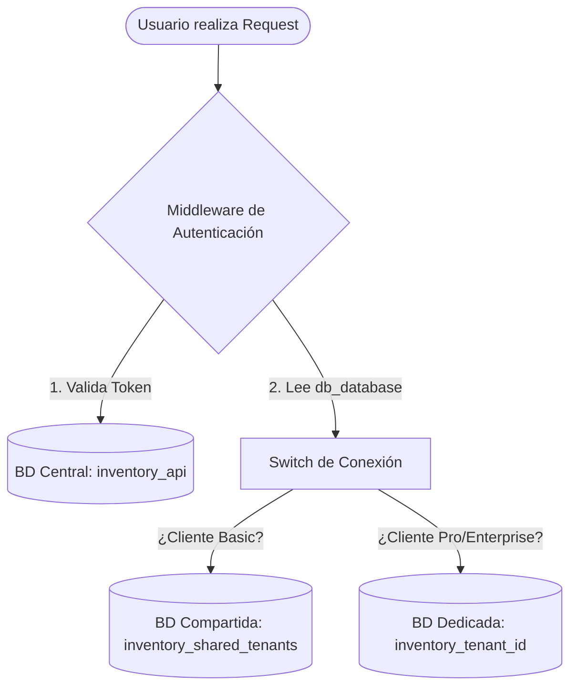

# 📘 Especificación Detallada del Roadmap: Transformación a SaaS ERP (Híbrido)

Este documento detalla el alcance completo, las implicaciones técnicas, los endpoints propuestos y la arquitectura de base de datos necesaria para cada módulo. 

Esta versión incorpora la **Arquitectura Multi-tenancy Híbrida** para soportar planes compartidos y dedicados, dejando lista la estructura técnica sin que afecte la facturación automática de momento.

---

## 🏢 Núcleo Técnico: Arquitectura Multi-tenancy Híbrida

El sistema operará con dos tipos de alojamiento (Tiers) según el volumen de facturación y plan del cliente, gestionados a través de conexiones de bases de datos dinámicas en Laravel.

### 1. Base de Datos Central (Shared/Landlord)
*   **Nombre de BD:** `inventory_api` (Base de datos por defecto del sistema).
*   **Contenido:** Tablas globales que nunca se replican.
    *   `users` (Credenciales, tokens de Sanctum y `organization_id`).
    *   `organizations` (Registros de clientes, subdominio, `tenancy_type` [shared/dedicated] y `db_database`).
    *   `roles`, `permissions`, `model_has_roles` (Seguridad global de accesos).
    *   `modules`, `organization_module` (Estatus de módulos contratados por inquilino).

### 2. Bases de Datos de Tenants (Inquilinos)
Las tablas de negocio (`products`, `invoices`, `inventories`, `stores`, etc.) se alojarán en una de estas dos opciones de base de datos:
*   **Opción A: Inquilinos Básicos (Shared DB)**
    *   **Base de datos:** `inventory_shared_tenants`.
    *   **Rango:** 0 a 2,000 ventas mensuales.
    *   **Aislamiento:** Lógico, mediante la columna `organization_id` en cada tabla y el uso del Trait `Multitenantable` (Global Scope) en Laravel.
*   **Opción B: Inquilinos Pro / Enterprise (Dedicated DB)**
    *   **Base de datos:** `inventory_tenant_{organization_id}`.
    *   **Rango:** Más de 2,000 ventas mensuales o clientes corporativos.
    *   **Aislamiento:** Físico. Tienen su propio esquema completo en el servidor de base de datos, lo que garantiza velocidad e independencia en backups.

---

## 🗺️ Índice de Módulos (Orden de Desarrollo)

1. [Módulo 1: Usuarios, Roles y Permisos](#1-usuarios-roles-y-permisos-prioridad-1)
2. [Módulo 2: Multi-moneda](#2-multi-moneda-prioridad-2)
3. [Módulo 3: SaaS e Infraestructura Híbrida de Conexión](#3-saas-e-infraestructura-híbrida-de-conexión-prioridad-3)
4. [Módulo 4: Caja y Turnos (POS)](#4-caja-y-turnos-pos-prioridad-4)
5. [Módulo 5: Tesorería Básica](#5-tesorería-básica-prioridad-5)
6. [Módulo 6: Ciclo Comercial y Devoluciones](#6-ciclo-comercial-y-devoluciones-prioridad-6)
7. [Módulo 7: Logística Avanzada y Transferencias](#7-logística-avanzada-y-transferencias-prioridad-7)
8. [Módulo 8: Integración con E-commerce (WooCommerce)](#8-integración-con-e-commerce-woocommerce-prioridad-8)
9. [Módulo 9: Contabilidad General](#9-contabilidad-general-prioridad-9)
10. [Módulo 10: Recursos Humanos, Nómina y Vendedores](#10-recursos-humanos-nómina-y-vendedores-prioridad-10)
11. [Módulo 11: Producción y Manufactura (MRP)](#11-producción-y-manufactura-mrp-prioridad-11)

---

## 1. Usuarios, Roles y Permisos (Prioridad 1)

### 🎯 Objetivo
Garantizar la seguridad interna del sistema controlando las acciones de cada usuario (cajero, administrador, contador, etc.) y limitando su acceso a sucursales específicas.

### 📋 Alcance
*   CRUD de Roles y Permisos a nivel de Organización/Tenant (utilizando la base de Spatie).
*   Asociación de usuarios a sucursales específicas (`stores`).
*   Restricción de endpoints API según el rol y los permisos del token de Sanctum.

### 🗄️ Base de Datos y Modelos (En BD Central)
*   **Tablas:** `users`, `roles`, `permissions`, `model_has_roles`, `model_has_permissions`, `role_has_permissions`.
*   **Relación:** Los usuarios se autentican de forma global contra la base de datos central.

### 🔌 Endpoints Clave
*   `GET /api/v1/roles` (Listar roles disponibles)
*   `POST /api/v1/users/{id}/roles` (Asignar rol a usuario)
*   `POST /api/v1/users/{id}/stores` (Asociar usuario a tiendas específicas)

### ⚠️ Afectación a lo Existente
*   Los controladores existentes (`StoreController`, `InvoiceController`, etc.) deben configurarse con middlewares restrictivos de Laravel (ej: `middleware('permission:ver-ventas')`).

### 🛠️ Checklist de Implementación
- [ ] Definir catálogo inicial de Permisos y Roles semilla (`RolesAndPermissionsSeeder`).
- [ ] Crear Middleware de validación de permisos en rutas de la API.
- [ ] Crear endpoints para administración de usuarios y asignación de roles.
- [ ] Proteger endpoints existentes con políticas de acceso (Policies).

---

## 2. Multi-moneda (Prioridad 2)

### 🎯 Objetivo
Permitir que el ERP opere con transacciones financieras en diferentes divisas, protegiendo al sistema de devaluaciones o permitiendo ventas en USD y cobros en moneda local.

### 📋 Alcance
*   Registro de monedas activas por la organización con símbolos y códigos ISO.
*   Registro histórico diario de tasas de cambio (Exchange Rates) respecto a la moneda base del tenant.
*   Precios de productos en divisas alternativas.
*   Cobros de facturas y registros de compras guardando la tasa de cambio utilizada de forma histórica.

### 🗄️ Base de Datos y Modelos (En BD Tenant)
*   **[NUEVO] Modelo `Currency` (`currencies`):** `id` (UUID), `organization_id` (UUID), `name`, `code` (USD, CRC, COP), `symbol`, `is_base` (boolean), `status`.
*   **[NUEVO] Modelo `ExchangeRate` (`exchange_rates`):** `id` (UUID), `currency_id` (UUID), `rate` (decimal 12,4), `date` (date).
*   **Modificaciones en `products`:** añadir `currency_id`.
*   **Modificaciones en `invoices` y `purchases`:** añadir `currency_id` y `exchange_rate` (tasa aplicada).

### 🔌 Endpoints Clave
*   `GET /api/v1/currencies` (Listar monedas activas)
*   `POST /api/v1/exchange-rates` (Registrar tasa de cambio del día)

### ⚠️ Afectación a lo Existente
*   **Impacto crítico:** Los cálculos de subtotales, totales e inventario en `invoices`, `invoice_details`, `purchases` y `inventories` deben convertirse a la moneda base de la organización usando el `exchange_rate` histórico.

### 🛠️ Checklist de Implementación
- [ ] Crear migración y modelo para `Currency` y `ExchangeRate`.
- [ ] Añadir columnas de relación en las migraciones de `products`, `invoices` y `purchases`.
- [ ] Desarrollar helper de conversión monetaria reutilizable en Laravel.
- [ ] Modificar controladores de ventas y compras para capturar y validar la divisa y tipo de cambio en el Request.

---

## 3. SaaS e Infraestructura Híbrida de Conexión (Prioridad 3)

### 🎯 Objetivo
Establecer la estructura de asignación dinámica de bases de datos para clientes Basic (compartida) y Pro/Enterprise (dedicada), además del control de acceso a módulos específicos. De momento, no afectará a la facturación (pasarelas de pago suspendidas temporalmente), enfocándose únicamente en la funcionalidad estructural.

### 📋 Alcance
*   **Esquema Híbrido:** Gestión en la base de datos central de los campos `tenancy_type` y `db_database` por organización.
*   **Conexión Dinámica (Middleware):** Conectar al cliente a la base de datos compartida o a su base de datos privada en caliente según su registro.
*   **Trait `Multitenantable`:** Scope de consulta automática para clientes compartidos (`WHERE organization_id = ?`).
*   **Activación de Módulos:** Habilitar o deshabilitar accesos a nivel de inquilino para las distintas rutas de la API.

### 🗄️ Base de Datos y Modelos (En BD Central)
*   **Modificaciones en `organizations`:**
    *   `tenancy_type` (enum: `shared`, `dedicated`).
    *   `db_database` (string: nombre físico de la base de datos asignada).
*   **Tablas Existentes:** `modules`, `organization_module` (asocian qué organización tiene activo cada módulo del sistema).

### 🔌 Endpoints Clave
*   `GET /api/v1/saas/my-license` (Ver tipo de alojamiento y lista de módulos activos para la organización)
*   `POST /api/v1/saas/admin/organizations/{id}/switch-tier` (Comando interno para migrar un cliente de BD compartida a BD dedicada)

### ⚠️ Afectación a lo Existente
*   **Estructuración de Migraciones:** Se debe dividir el directorio de migraciones:
    *   `database/migrations` -> Contiene únicamente las tablas globales de la base de datos central.
    *   `database/migrations/tenant` -> Contiene las tablas del negocio (`products`, `invoices`, etc.) que se migrarán dinámicamente en las bases de datos de inquilinos.

### 🛠️ Checklist de Implementación
- [ ] Modificar la tabla `organizations` para añadir los campos `tenancy_type` y `db_database`.
- [ ] Crear el Trait `Multitenantable` con el Global Scope para `organization_id`.
- [ ] Crear el Middleware `TenantDatabaseSwitcher` para interceptar cada Request y cambiar la conexión MySQL por defecto a la base de datos en `db_database`.
- [ ] Configurar el sistema de comandos de Artisan en Laravel para correr las migraciones en bases de datos específicas de inquilinos de forma masiva.

---

## 4. Caja y Turnos (POS) (Prioridad 4)

### 🎯 Objetivo
Garantizar el control del efectivo circulante en los puntos de venta físicos (POS) mediante la auditoría obligatoria de turnos de cajeros.

### 📋 Alcance
*   **Apertura de Caja:** Declaración de saldo base (efectivo inicial en gaveta).
*   **Cierre de Caja (Arqueo):** Declaración final de efectivo físico, cálculo de transacciones electrónicas y reporte de faltantes/sobrantes.
*   **Turnos de Cajero:** Registro de inicio y fin de jornada con el cajero asignado.

### 🗄️ Base de Datos y Modelos (En BD Tenant)
*   **[NUEVO] Modelo `CashSession` (`cash_sessions`):**
    *   `id` (UUID), `store_id` (UUID), `user_id` (UUID), `opened_at` (datetime), `closed_at` (datetime), `opening_balance` (decimal), `closing_balance` (decimal), `real_cash` (decimal), `status` (open/closed).
*   **[NUEVO] Modelo `CashSessionMovement` (`cash_session_movements`):**
    *   `id` (UUID), `cash_session_id` (UUID), `type` (income/expense), `amount`, `reason`, `reference_id`, `reference_type`.

### 🔌 Endpoints Clave
*   `POST /api/v1/cash-sessions/open` (Abrir turno de caja)
*   `POST /api/v1/cash-sessions/close` (Cerrar caja y arqueo)

### ⚠️ Afectación a lo Existente
*   **Facturación (`invoices`):** Al guardar una factura con tipo de pago "Efectivo", se debe verificar obligatoriamente que haya una `cash_sessions` abierta para el usuario en esa tienda y registrar la entrada de efectivo vinculada.

### 🛠️ Checklist de Implementación
- [ ] Crear migraciones y modelos `CashSession` y `CashSessionMovement` en la carpeta `database/migrations/tenant`.
- [ ] Modificar controlador de facturación para verificar estado de caja antes de registrar ventas.
- [ ] Crear lógica de arqueo y cálculo de diferencias al cerrar el turno.
- [ ] Endpoint de reportes de cortes de caja para administradores.

---

## 5. Tesorería Básica (Prioridad 5)

### 🎯 Objetivo
Administrar los fondos de la organización en cuentas bancarias, controlar los egresos mediante caja chica y realizar conciliaciones de los flujos monetarios globales.

### 📋 Alcance
*   CRUD de Cuentas Bancarias de la organización.
*   Gestión de Caja Chica por tienda con límites máximos configurables de reposición.
*   Registro de egresos / gastos operativos del día.
*   Transferencias de dinero internas (ej. de efectivo POS a depósito en banco).

### 🗄️ Base de Datos y Modelos (En BD Tenant)
*   **[NUEVO] Modelo `BankAccount` (`bank_accounts`):** `id` (UUID), `organization_id` (UUID), `bank_name`, `account_number`, `currency_id` (UUID), `balance` (decimal), `status`.
*   **[NUEVO] Modelo `PettyCash` (`petty_cashes`):** `id` (UUID), `store_id` (UUID), `name`, `max_limit` (decimal), `current_balance` (decimal), `status`.
*   **[NUEVO] Modelo `PettyCashMovement` (`petty_cash_movements`):** `id` (UUID), `petty_cash_id` (UUID), `type` (income/expense), `amount`, `description`, `user_id` (UUID).
*   **[NUEVO] Modelo `BankMovement` (`bank_movements`):** `id` (UUID), `bank_account_id` (UUID), `type` (deposit/withdrawal), `amount`, `description`, `reference_id` (nullable).

### 🔌 Endpoints Clave
*   `GET /api/v1/bank-accounts` (Listar cuentas bancarias)
*   `POST /api/v1/petty-cash/expense` (Registrar un gasto de caja chica)

### ⚠️ Afectación a lo Existente
*   Los cobros de facturas y los abonos de créditos (`credits`) deben especificar a qué cuenta bancaria o caja chica ingresa el dinero, actualizando los saldos monetarios de forma automática.

### 🛠️ Checklist de Implementación
- [ ] Crear migraciones y modelos de Cuentas Bancarias y Caja Chica en `database/migrations/tenant`.
- [ ] Desarrollar el flujo para egresos de caja chica (vales de caja).
- [ ] Integrar cobros y pagos con los balances de tesorería.
- [ ] Crear interfaz de movimientos generales de dinero para conciliación.

---

## 6. Ciclo Comercial y Devoluciones (Prioridad 6)

### 🎯 Objetivo
Completar el flujo comercial administrativo del ERP agregando Notas de Crédito, Notas de Débito, Devoluciones físicas de mercancía y el flujo de cuentas por pagar a proveedores.

### 📋 Alcance
*   **Notas de Crédito:** Anulación legal total o parcial de facturas.
*   **Notas de Débito:** Cargos adicionales pos-facturación.
*   **Devoluciones:** Retorno automático de stock dañado o en buen estado al inventario.
*   **Cuentas por Pagar:** Registro de deudas a proveedores al comprar a crédito y programación de sus pagos.

### 🗄️ Base de Datos y Modelos (En BD Tenant)
*   **[NUEVO] Modelo `CreditNote` (`credit_notes`):** `id` (UUID), `invoice_id` (UUID), `client_id` (UUID), `amount` (decimal), `reason`, `status`.
*   **[NUEVO] Modelo `CreditNoteDetail` (`credit_note_details`):** `id` (UUID), `credit_note_id` (UUID), `product_id` (UUID), `quantity` (int), `unit_price` (decimal).
*   **[NUEVO] Modelo `AccountsPayable` (`accounts_payable`):** `id` (UUID), `supplier_id` (UUID), `purchase_id` (UUID, nullable), `total_amount`, `balance_due`, `due_date`, `status`.
*   **[NUEVO] Modelo `SupplierPayment` (`supplier_payments`):** `id` (UUID), `accounts_payable_id` (UUID), `bank_account_id` (UUID), `amount` (decimal), `paid_at`.

### 🔌 Endpoints Clave
*   `POST /api/v1/credit-notes` (Crear Nota de Crédito con o sin retorno de stock)
*   `GET /api/v1/accounts-payable` (Listar cuentas por pagar pendientes)

### ⚠️ Afectación a lo Existente
*   Afecta a `invoices` (las notas de crédito reducen el saldo de la factura) y a los modelos de inventario (`inventories`/`inventory_details`), ya que las devoluciones deben reingresar stock físico al sistema de forma atómica.

### 🛠️ Checklist de Implementación
- [ ] Crear modelos y migraciones de Notas de Crédito/Débito en `database/migrations/tenant`.
- [ ] Crear la lógica de Cuentas por Pagar vinculada al flujo de compras (`purchases`).
- [ ] Implementar la reversión de stock automatizada en transacciones de inventario al procesar devoluciones.
- [ ] Diseñar el panel de abonos a proveedores afectando las cuentas bancarias de Tesorería.

---

## 7. Logística Avanzada y Transferencias (Prioridad 7)

### 🎯 Objetivo
Controlar el flujo de mercancía entre múltiples sucursales u oficinas centrales, y añadir trazabilidad avanzada de stock por lotes, fechas de vencimiento y números de serie.

### 📋 Alcance
*   **Transferencia entre Sucursales:** Control de traslados con flujo de tres pasos: Solicitado $\rightarrow$ Despachado (En Tránsito) $\rightarrow$ Recibido (Aceptación total o parcial).
*   **Lotes y Vencimientos:** Control de caducidad de inventario (crucial para farmacias/alimentos).
*   **Números de Serie:** Trazabilidad única (código de barra individual) para dispositivos electrónicos.

### 🗄️ Base de Datos y Modelos (En BD Tenant)
*   **[NUEVO] Modelo `StockTransfer` (`stock_transfers`):** `id` (UUID), `source_store_id` (UUID), `destination_store_id` (UUID), `user_id` (UUID), `status` (pending, in_transit, received, cancelled), `sent_at`, `received_at`.
*   **[NUEVO] Modelo `StockTransferDetail` (`stock_transfer_details`):** `id` (UUID), `stock_transfer_id` (UUID), `product_id` (UUID), `quantity` (int).
*   **Modificaciones en `products` y `inventory_details`:**
    *   Campos `batch_number` (string, nullable), `expiry_date` (date, nullable), `serial_number` (string, nullable).

### 🔌 Endpoints Clave
*   `POST /api/v1/transfers` (Iniciar solicitud de transferencia)
*   `POST /api/v1/transfers/{id}/receive` (Recibir en destino y sumar stock físico)

### ⚠️ Afectación a lo Existente
*   El inventario no debe sumarse de inmediato a la tienda destino al crear la transferencia. Debe existir una bodega o estatus lógico virtual de "En Tránsito" para evitar duplicaciones y reportes erróneos de stock.

### 🛠️ Checklist de Implementación
- [ ] Migraciones y modelos de Transferencias y Ajustes Físicos en `database/migrations/tenant`.
- [ ] Modificar tablas de productos/inventario para soportar lotes y series.
- [ ] Crear la lógica de estados de transferencia en base de datos.
- [ ] Implementar el control estricto de egresos y entradas físicas de stock en base a lotes específicos durante la venta y compra.

---

## 8. Integración con E-commerce (WooCommerce) (Prioridad 8)

### 🎯 Objetivo
Sincronizar el canal de venta físico (POS/Tiendas) y el canal digital (WordPress/WooCommerce) en tiempo real para evitar discrepancias de existencias.

### 📋 Alcance
*   Sincronización de productos: Nombre, fotos, precio y descripciones del ERP a WooCommerce.
*   Sincronización de inventario: Cualquier cambio de stock físico en el ERP (por venta, compra o devolución) actualiza la web.
*   Descarga de pedidos: Las compras online se descargan e integran al ERP automáticamente como facturas pagadas o pendientes.

### 🗄️ Base de Datos y Modelos (En BD Tenant)
*   **Modificaciones en `products`:** Añadir campos `woocommerce_id` (externo), `sync_status` (pending/synced/error), `last_synced_at`.
*   **[NUEVO] Modelo `EcomSyncLog` (`ecom_sync_logs`):** Trazabilidad de fallas de sincronización API.

### 🔌 Endpoints Clave
*   `POST /api/v1/ecommerce/sync-products` (Fuerza la subida de catálogo completo)
*   `POST /api/v1/ecommerce/webhook/order-created` (Webhook expuesto para recibir pedidos de WooCommerce)

### ⚠️ Afectación a lo Existente
*   **Performance:** No se deben hacer peticiones HTTP a WordPress de forma síncrona en el request del usuario. Se deben utilizar **Laravel Jobs (Colas)** para procesar la sincronización en segundo plano de manera asíncrona.

### 🛠️ Checklist de Implementación
- [ ] Instalar cliente HTTP para WooCommerce y configurar credenciales en `.env`.
- [ ] Crear Observers en el modelo `InventoryDetail` para disparar eventos de cambio de stock.
- [ ] Crear Jobs asíncronos en Laravel para envíos en cola hacia la API de WooCommerce.
- [ ] Crear Endpoint receptor de Webhook de compras de WordPress con su correspondiente validación de seguridad.

---

## 9. Contabilidad General (Prioridad 9)

### 🎯 Objetivo
El cerebro del ERP. Automatizar el registro de asientos contables por partida doble de cada movimiento del negocio (ventas, compras, pagos, gastos) para generar reportes fiscales en tiempo real.

### 📋 Alcance
*   **Plan de Cuentas Contable:** Estructura jerárquica de cuentas (Activos, Pasivos, Capital, Ingresos, Costos, Gastos).
*   **Reglas Contables:** Definición de qué cuenta carga y qué cuenta abona por cada acción operativa del sistema.
*   **Asiento Contable Automático:** Creación desatendida de pólizas de diario por cada venta, compra o pago.
*   **Estados Financieros:** Balance General, Balanza de Comprobación e Informe de Pérdidas y Ganancias (P&G).

### 🗄️ Base de Datos y Modelos (En BD Tenant)
*   **[NUEVO] Modelo `ChartOfAccount` (`chart_of_accounts`):**
    *   `id` (UUID), `organization_id` (UUID), `code` (string), `name`, `type` (asset, liability, equity, revenue, expense), `parent_id` (UUID, nullable).
*   **[NUEVO] Modelo `JournalEntry` (`journal_entries`):**
    *   `id` (UUID), `organization_id` (UUID), `description`, `date`, `reference_id` (UUID), `reference_type` (string).
*   **[NUEVO] Modelo `JournalItem` (`journal_items`):**
    *   `id` (UUID), `journal_entry_id` (UUID), `account_id` (UUID), `debit` (decimal), `credit` (decimal).

### 🔌 Endpoints Clave
*   `GET /api/v1/accounting/chart` (Ver plan de cuentas)
*   `GET /api/v1/accounting/balance-sheet` (Obtener balance general en tiempo real)
*   `GET /api/v1/accounting/profit-loss` (Obtener estado de pérdidas y ganancias)

### ⚠️ Afectación a lo Existente
*   **Desacoplamiento:** Muy alto impacto. Para no ensuciar la base del código de facturación/compras con contabilidad, se debe utilizar el sistema de eventos de Laravel (`Event::dispatch`). Cuando ocurre una venta, el módulo contable escucha el evento y genera el asiento contable de forma aislada.

### 🛠️ Checklist de Implementación
- [ ] Crear migración y modelo para Catálogo Contable y Pólizas/Asientos en `database/migrations/tenant`.
- [ ] Implementar validador de partida doble (Suma Débito == Suma Crédito) antes de guardar un asiento.
- [ ] Crear Listeners para eventos del ERP (`InvoiceCreated`, `PurchaseCreated`, `PaymentReceived`).
- [ ] Desarrollar lógica de cálculo acumulado en base a rangos de fechas para reportes de Pérdidas y Ganancias.

---

## 10. Recursos Humanos, Nómina y Vendedores (Prioridad 10)

### 🎯 Objetivo
Administrar el personal de la empresa, registrar marcas de asistencia diaria y automatizar el cálculo de comisiones de la fuerza de ventas integrada.

### 📋 Alcance
*   **Expedientes de Empleados:** Contratos, salarios bases, puesto y datos personales.
*   **Control de Asistencia:** Registro de marcas de entrada y salida (reloj marcador digital).
*   **Comisiones de Ventas:** Reglas dinámicas (ej: 5% sobre ventas netas cobradas) ligadas al vendedor.
*   **Cálculo de Nómina/Planilla:** Generación de recibos de sueldo desglosando deducciones, sueldo base, horas extras y comisiones.

### 🗄️ Base de Datos y Modelos (En BD Tenant, con relaciones a BD Central)
*   **[NUEVO] Modelo `Employee` (`employees`):** `id` (UUID), `organization_id` (UUID), `user_id` (UUID, nullable), `first_name`, `last_name`, `base_salary`, `status`.
*   **[NUEVO] Modelo `Attendance` (`attendances`):** `id` (UUID), `employee_id` (UUID), `check_in` (datetime), `check_out` (datetime).
*   **[NUEVO] Modelo `Payroll` (`payrolls`):** `id` (UUID), `employee_id` (UUID), `period_start` (date), `period_end` (date), `base_salary`, `commissions`, `deductions`, `net_salary`, `status`.
*   **[NUEVO] Modelo `CommissionLog` (`commission_logs`):** `id` (UUID), `seller_id` (UUID), `invoice_id` (UUID), `commission_amount` (decimal), `status` (pending/paid).

### 🔌 Endpoints Clave
*   `POST /api/v1/attendance/clock-in` (Marcar entrada de empleado)
*   `GET /api/v1/sellers/{id}/commissions` (Ver comisiones acumuladas del vendedor)

### ⚠️ Afectación a lo Existente
*   Las tablas `sellers` (vendedores), `seller_store`, `seller_id` en `invoices` y `credit_details` ya existen en base de datos. Se usará este campo `seller_id` en las facturas para correr el script mensual de cálculo de comisiones devengadas.

### 🛠️ Checklist de Implementación
- [ ] Crear modelos y tablas para Empleados, Asistencia y Nómina en `database/migrations/tenant`.
- [ ] Desarrollar el lector/marcador de asistencia en base a código PIN de usuario.
- [ ] Programar script de cálculo de comisiones que analice `invoices` cerradas de cada vendedor.
- [ ] Crear el generador de recibos de nómina.

---

## 11. Producción y Manufactura (MRP) (Prioridad 11)

### 🎯 Objetivo
Facilitar a los clientes del SaaS que transforman insumos la gestión de recetas (lista de materiales) y órdenes de producción, controlando las existencias de materias primas y productos listos para la venta.

### 📋 Alcance
*   **Recetas / Lista de Materiales (BOM):** Relación de insumos requeridos por unidad de producto terminado (ej: 200g harina + 50g azúcar = 1 Pastel).
*   **Órdenes de Producción:** Proceso administrativo para procesar la manufactura.
*   **Costo de Fabricación:** Suma del costo de los insumos (PEPS o promedio ponderado) más costos de mano de obra configurados para calcular el costo de entrada del producto final.

### 🗄️ Base de Datos y Modelos (En BD Tenant)
*   **[NUEVO] Modelo `BillOfMaterial` (`bill_of_materials`):** `id` (UUID), `product_id` (UUID, producto terminado), `description`, `labor_cost` (decimal), `status`.
*   **[NUEVO] Modelo `BOMDetail` (`bom_details`):** `id` (UUID), `bill_of_materials_id` (UUID), `ingredient_product_id` (UUID, insumo), `quantity_required` (decimal).
*   **[NUEVO] Modelo `ProductionOrder` (`production_orders`):** `id` (UUID), `store_id` (UUID), `product_id` (UUID), `quantity_to_produce`, `status` (pending/processing/completed/cancelled).

### 🔌 Endpoints Clave
*   `POST /api/v1/production/bom` (Definir receta para un producto terminado)
*   `POST /api/v1/production/orders` (Crear orden de fabricación)

### ⚠️ Afectación a lo Existente
*   Afecta a `inventories` e `inventory_details`. Al completar una orden de producción, se debe ejecutar una transacción de base de datos atómica que realice salidas de inventario para todos los insumos de la receta y una entrada de inventario para el producto terminado en la tienda correspondiente.

### 🛠️ Checklist de Implementación
- [ ] Crear modelos y tablas para Recetas (BOM) y Órdenes de Producción en `database/migrations/tenant`.
- [ ] Desarrollar validador de existencia de materias primas antes de iniciar la producción.
- [ ] Crear controlador de transacciones atómicas de stock para descontar insumos e ingresar el producto finalizado.
- [ ] Implementar recálculo automático del costo promedio del producto finalizado en base al costo histórico de insumos consumidos.
